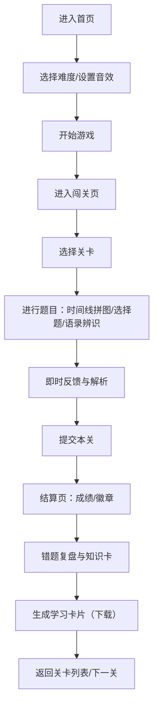

## 1. 产品概述
以“红色经典”为叙事外壳的党史闯关网页小游戏：玩家通过“时间线拼图 + 选择题 + 经典语录辨识”完成关卡，收集徽章并生成学习卡片，适合课堂活动与自学复盘。
- 目标用户：中学/高校学生、党建学习者、社团活动组织者
- 价值：用轻量游戏化方式提升记忆与理解，提供可分享的学习成果

## 2. 核心功能

### 2.1 用户角色（可选）
本产品默认无需注册，使用单一角色即可满足体验。
| 角色 | 使用方式 | 核心权限 |
|------|----------|----------|
| 玩家 | 直接进入 | 游玩闯关、查看知识卡、生成学习卡片 |

### 2.2 功能模块
1. **首页/序章**：游戏介绍、开始游戏、学习卡片入口、设置（音效/难度）
2. **闯关页**：关卡列表、题型玩法（时间线拼图/选择题/语录辨识）、实时反馈、提示道具
3. **结算页**：成绩与徽章、错题复盘、生成学习卡片（可下载图片）

### 2.3 页面明细
| 页面名称 | 模块名称 | 功能描述 |
|---------|----------|----------|
| 首页/序章 | 主题海报区 | 红色经典风格主视觉、简短玩法说明、进入按钮 |
| 首页/序章 | 设置面板 | 音效开关、难度选择（入门/标准/挑战） |
| 闯关页 | 关卡列表 | 展示关卡进度、解锁规则、徽章预览 |
| 闯关页 | 时间线拼图 | 将事件卡片拖拽排序，提交后判分与解析 |
| 闯关页 | 选择题 | 单选题，选后即时反馈与解析 |
| 闯关页 | 语录辨识 | 给出语录/出处/年代，匹配正确来源或背景 |
| 闯关页 | 道具系统 | 1次提示（高亮两张可交换卡/排除两个选项），冷却提示 |
| 结算页 | 成绩面板 | 本关得分、用时、连击、徽章获得情况 |
| 结算页 | 错题复盘 | 错题列表、正确答案、知识点卡片 |
| 结算页 | 学习卡片 | 生成“我完成了××关”海报，下载为图片 |

## 3. 核心流程
玩家从首页进入闯关，完成当前关卡的多题型挑战，结算后可复盘并进入下一关。

## 4. 用户界面设计
### 4.1 设计风格
- 主色：深红（庄重）、米白（纸张感）、墨黑（印刷感）
- 辅色：金色点缀（徽章/高光）
- 按钮：微立体压印感，悬停有“纸张抬起”动效
- 字体：标题采用具有报刊感的展示字体，正文采用清晰易读的衬线/黑体组合
- 布局：桌面端优先，卡片化关卡与题目区域；局部使用“档案/海报”装饰边框
- 图标：徽章、五角星、旗帜、印章等符号化图形（避免过度花哨）

### 4.2 页面设计概览
| 页面名称 | 模块名称 | UI要素 |
|---------|----------|--------|
| 首页/序章 | 主题海报区 | 大标题、年代刻度装饰、主按钮、入场动画（淡入+轻微抖动胶片颗粒） |
| 闯关页 | 时间线拼图 | 事件卡片（纸张阴影）、拖拽排序、提交后正确项高亮（绿色/金色描边） |
| 闯关页 | 解析卡 | “知识点卡片”以档案纸样式呈现，含关键词高亮 |
| 结算页 | 成绩面板 | 徽章墙、分数仪表、用时条、下载学习卡按钮 |

### 4.3 响应式
桌面端优先；移动端采用单列布局、增大触控区域、拖拽题型提供“上下移动按钮”替代拖拽以保证可用性。

