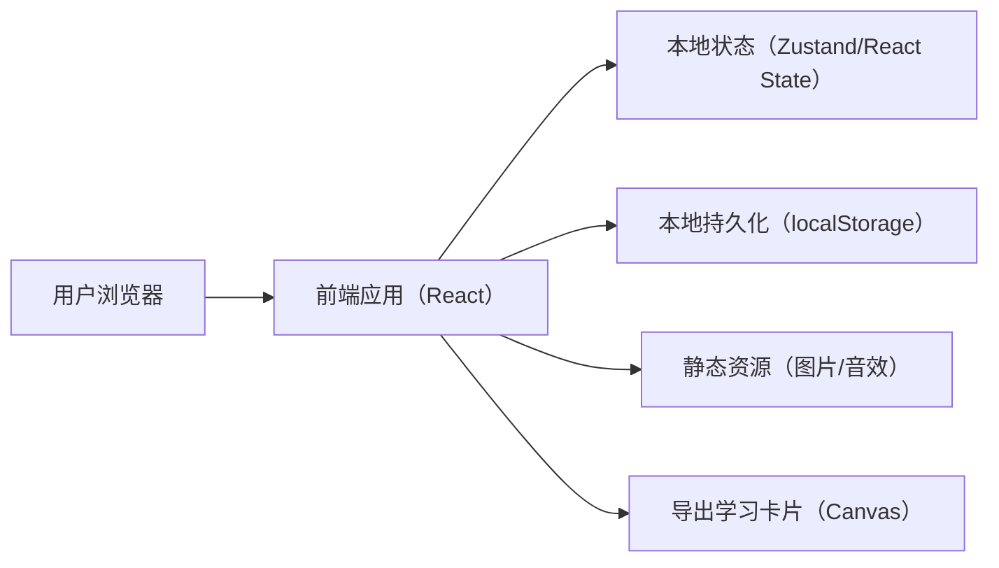
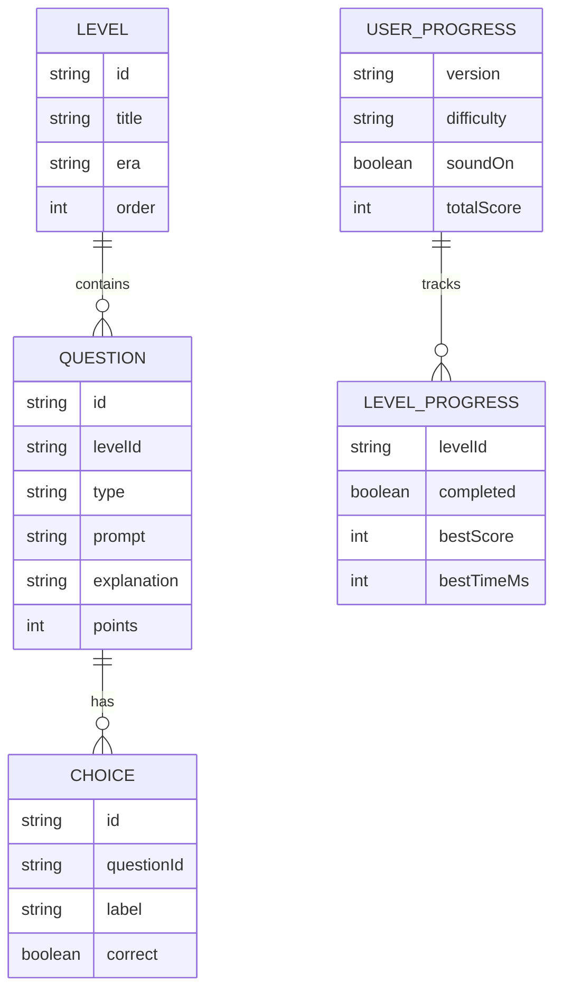

## 1. 架构设计

## 2. 技术说明
- 前端：React@18 + TypeScript + Vite
- 样式：Tailwind CSS + 少量自定义 CSS（纹理、动画、特殊排版）
- 状态管理：优先使用 React 内置状态；如关卡/进度较复杂则引入轻量状态库（Zustand）
- 数据：内置 JSON 题库（按关卡/题型组织）；进度与设置写入 localStorage
- 后端：无（纯前端离线可运行）

## 3. 路由定义
| 路由 | 用途 |
|------|------|
| / | 首页/序章 |
| /play | 闯关页 |
| /result | 结算页 |

## 4. API 定义（无后端）
不提供远程 API；题库、配置与导出逻辑均在前端完成。

## 5. 数据模型

### 5.1 数据模型定义

### 5.2 数据定义语言（本地数据，不落库）
使用 `src/data/levels.ts` / `src/data/questions.ts` 的 TypeScript 常量导出；用户进度序列化为 JSON 存入 localStorage：
- key：`rhg_progress_v1`
- key：`rhg_settings_v1`

